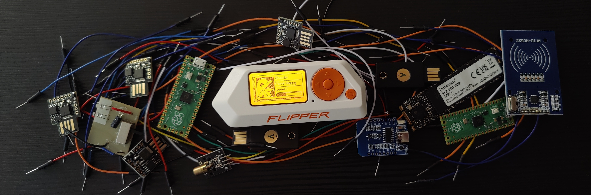

```console
┌──(kali㉿kali)-[~]
└─$ nc jazper.dk 2003

     ██╗ █████╗ ███████╗██████╗ ███████╗██████╗ 
     ██║██╔══██╗██╔════╝██╔══██╗██╔════╝██╔══██╗
     ██║███████║███████╗██████╔╝█████╗  ██████╔╝
██   ██║██╔══██║╚════██║██╔═══╝ ██╔══╝  ██╔══██╗
╚█████╔╝██║  ██║███████║██║     ███████╗██║  ██║
 ╚════╝ ╚═╝  ╚═╝╚══════╝╚═╝     ╚══════╝╚═╝  ╚═╝

- LinkedIn:  https://www.linkedin.com/in/jasper-onsberg-christiansen/             
- Website:   https://jazper.dk/
- Email:     jasper@jazper.dk
- Work:      Software Developer @ AIR SUPPORT A/S
- Age:       22 (19/1 - 2003)
```

 [](https://tryhackme.com/p/jazper)

[](https://git.io/typing-svg)

<details close>
<summary>Show more...</summary>

## Some of my projects
<details close>
<summary>Show</summary>

[**Bump Buddy Discord Bot:**](https://bumpbuddy.xyz) A discord chatbot made in C# using [DSharpPlus](https://github.com/DSharpPlus/DSharpPlus). The chatbot is in over 21.000 discord servers.

[**KanbanCord Discord Bot:**](https://github.com/j4asper/KanbanCord) An Open Source Kanban board made to be used in Discord.

[**XSploit CTF Team:**](https://github.com/XSploit-Team) A CTF (Capture the Flag) team, that aims to become better at pentesting.

[**dmr.py:**](https://github.com/j4asper/dmr.py) A python package, that allows programmers to easily fetch vehicle data from the danish vehicle registry.

</details>

## Socials
<details close>
<summary>Show</summary>

<a href="https://www.reddit.com/user/j4asper"></a>
<a href="https://www.snapchat.com/add/j4azper"></a>
<a href="https://twitter.com/Jazper1901"></a>
<a href="https://hub.docker.com/u/jazper"></a>
<a href="https://www.linkedin.com/in/jasper-onsberg-christiansen/"></a>
<a href="https://ctftime.org/user/159222"></a>
<a href="https://www.kaggle.com/jazper"></a>
<a href="https://steamcommunity.com/id/Jasper1901/"></a>
<a href="https://discord.com/users/282660538356596736"></a>
<a href="https://app.hackthebox.com/profile/261105"></a>
<a href="https://tryhackme.com/p/jazper?show_achievement_badg=blue"></a>
<a href="https://cryptohack.org/user/Jazper/"></a>
<a href="https://gitlab.com/j4asper"></a>

</details>

## Tools I've used
<details close>
<summary>Show</summary>

### Programming Languages:  

<a href="https://www.python.org/"></a>
<a href="https://docs.microsoft.com/en-us/dotnet/"></a>
<a href="https://www.javascript.com/"></a>

### Databases:
<a href="https://mongodb.com/"></a>
<a href="https://www.mysql.com/"></a>
<a href="https://www.sqlite.org"></a>
<a href="https://redis.io/"></a>
<a href="https://www.microsoft.com/da-dk/sql-server/sql-server-downloads"></a>

## Web:


### Other Technologies:

<a href="https://www.docker.com/"></a>
<a href="https://kubernetes.io//"></a>
<a href="https://github.com"></a>
<a href="https://www.cloudflare.com/"></a>
<a href="https://www.debian.org/"></a>
<a href="https://git-scm.com/"></a>


</details>

## Home Lab
<details close>
<summary>Show</summary>  
    
## Main server:  
**CPU:** AMD Ryzen 7 5700G (8 Cores)  
**RAM:** 64 GB  
**OS:**  [Unraid](https://unraid.net/)  
**Nickname:** The Beast  
**Storage:** 2x 2 TB harddrives (Raid 1 Configuration)  
**Cache:** 500 GB SSD  

## Kubernetes Cluster:  
**HP Elitedesk 800 G5 Mini**  
**CPU:** Intel Core i5-9500T (6 Cores)  
**RAM:** 16 GB  
**Storage:** 256 GB SSD  

## Home Assistant:  
**Intel Nuc**  
**CPU:** Intel Celeron J4025 (2 Cores)  
**RAM:** 8 GB  
**Storage:** 120 GB SSD  

## Home Network  
Home Network controlled with [TP-Link Omada SDN](https://www.tp-link.com/dk/omada-sdn/)  
Router: [TP-Link ER605](https://www.tp-link.com/dk/business-networking/omada-sdn-router/er605/)  
Controller: [TP-Link OC200](https://www.tp-link.com/dk/business-networking/omada-sdn-controller/oc200/)  
Access Point: [TP-Link EAP610](https://www.tp-link.com/dk/business-networking/omada-sdn-access-point/eap610/)  
Managed Switch: [TP-Link TL-SG108PE](https://www.tp-link.com/dk/business-networking/easy-smart-switch/tl-sg108pe/)  
300/300 WAN Speed  
 
</details>
